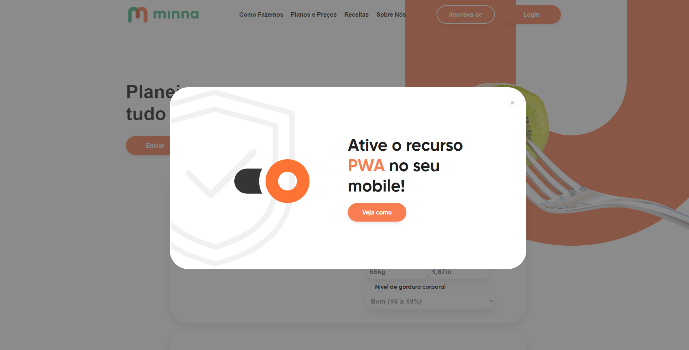

## 💻 Projeto

Este projeto é uma aplicação em REACTJS com TypeScript, para estilização foi utilizado Styled-Components e React Icons para adicionar os Icones.

<h2  align="center">

</h2>

### `yarn install` ou `npm install`

Para instalar as dependências.

### `yarn start` ou `npm run start`

Executa o aplicativo no modo de desenvolvimento.

Abra [http://localhost:3000](http://localhost:3000) para visualizá-lo no navegador.

Made with 💜 by <a  href="https://github.com/sararchh"  target="_blank">Sara Rocha</a>
